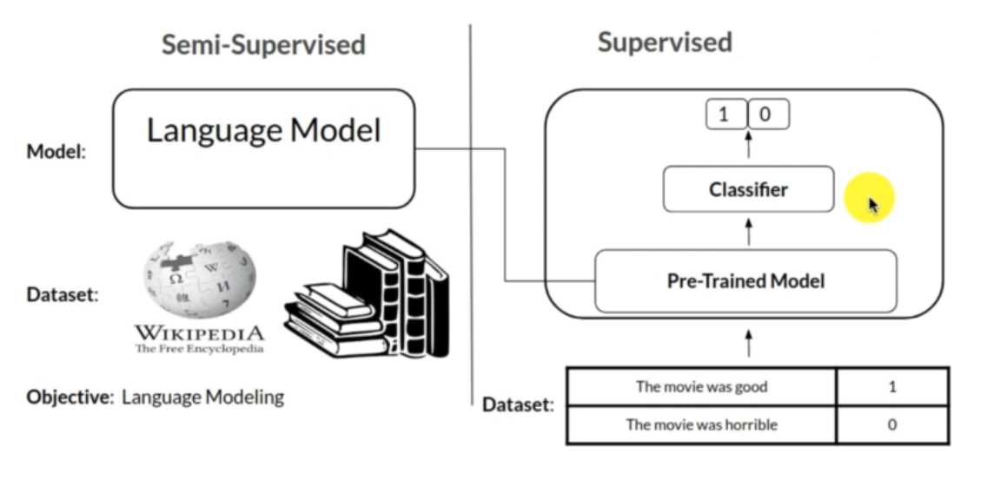
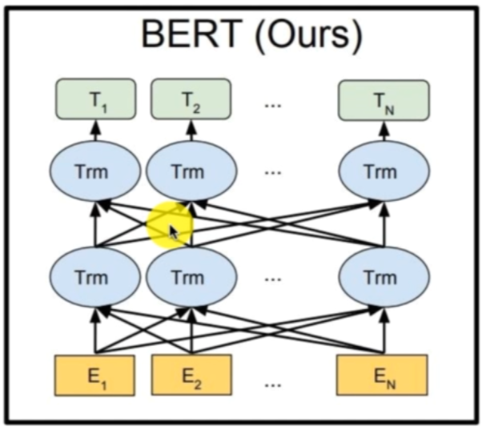
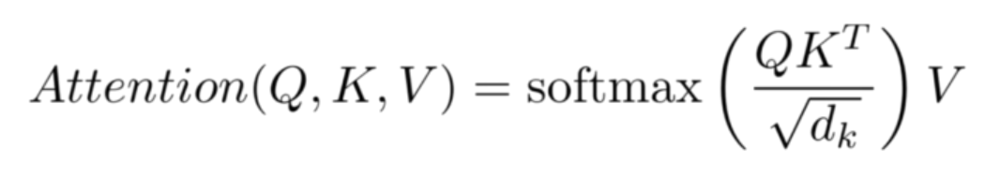
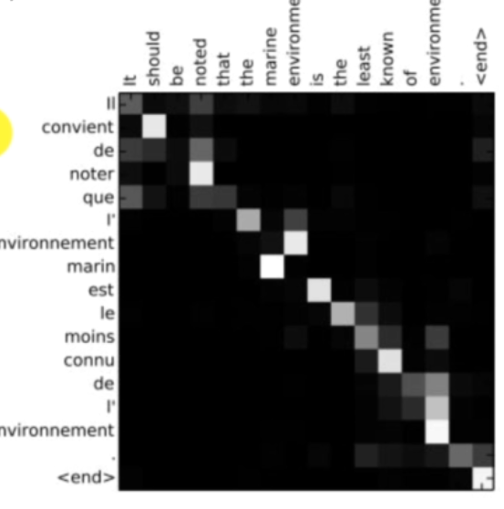

# Working with BERT for NLP


<br>

## Get the dataset from Kaggle :  <https://www.kaggle.com/durgancegaur/stanford-140-for-nlp>

## BERT Intuition
* ### Bert achitecturte
* ### BERT pre-traning

## Application
* ### Use tokenizer to process text data
* ### Use BERT as an emedding layer
* ### Fine-Tuningg BERT , the core of your model

## BERT- Bidirectional EncoderRepresentation from Transformers:
* ### Encoder Respresentations: pre-trained with unlabeled data, fine-tunning
* ### from Transformer: based on powerfull NLP algo  
* ### Bidirectional: 

## Image to text
* ### Word embedding : like using tokenizer.fit_on_text() to create a corpus.  and then fitting the traning data.
* ### Here the words with similar meaning will be close to each other in the embeded vectors.
## General Idea
* ### Transfer learning: fitting all the wikepedia and predict the next word.
* ### trained to predict the next word


### previously we used pseudo bidirectional in NLP
### Need access to whole sentence, to get better prediction
## Transfer learning OpenAI GPT:
* ### Uses transformers - with attention modeling.
* ### But uses left to right context - downpoint

## Now Transfer learning using BERT :
* ### use Transformer + Bidirectional
* ### but also uses (masked language model) made sence of using transformer


### Tansformers are better than LSTM's

## BERT pretraining phase:
* ### corpus : 800M (words) and English Wiki (25000M words).
* ### Two tasks: predictin the next word, next sentence prediction
* ### Language modeling system, and no chatbot, no translator as BERT does not offer sequence to word  as no decoder in BERT

<hr>

### Transformer used attentoion model
* ### encoder ---------------> Decoder ---------------> Goes for output sequence
* ### output form decoder----->Decoder/
* ### Give the whole sequence at once.
* ### putting the input in the encider and in the decoder inputing the start word which has no meaning

## Using self attendion model to get better 

### Finding the meaning of the sentence by not precoessign word by word , by combining each item to the other in the sentence.
*  
<br>

* ### Q.(K)trans   gives the corr() similarity between two sentences like one is orignal senteance and other is the translated sentence. 
* ### lets recombine V(=K)
<br>


*    


## Using Look-ahead mask

### during traning , we fead a sole output sentence to the decoder, but to predict word n, he must not look at word after n.
### Meaning it should take the output of the last value as the input of the next decoder

# BERT Architecture


<br>

## Stacks of encoder layers
* ### L: number of encoder layers
* ### H: Hidden size("embedding dim")
* ### A: Number of self-attedtion heads

## Types of BERT
 * ### BERT_base: L=12,H=768,A=12, parameters=110M
 * ### BERT_large: L=24,H=1024,A=16, parameters=340M
 
## Input Flexibility
* ### we need to be able to represent both single sentence and a pair of sentences to tackle many different tasks
* ### We want to have access to classidicati tool
<h2 align="center"> 

```
            [CLS]+SentenceA+[SEP]+SentenceB 
```
</h1>

### [CLS] : classification token
### [SEP] : Seperation token between 2 sentences

### What shape for sentences?
<br>

* ### string ---------> Tokenization (different for verbs and ###ing part)
* ### then now -----------> Token to id converter ---------> embedding --------> vectors

## WordPiece tokenizer:
* ### 30,522 common words 
* ### Deals with a new word by combining known words
* ### trade off between vocab size and out of vocab words
* ### Each one correspons to an ID so from strings we get numbers using computers

<hr>

## Encoder neeeded as inputs :
* ### Embeded Words
* ### indication about 1st or 2nd sentenace
* ### positional Embedding (like for transformer)
 

 ## Types of output

### Output for [CLS] Token --------------> for classification task.

### Representationf or each other token ------------> need to go to more details ----> ex > Finding the answer to question
<br><hr>

# BERT Pre-training

## Two phases:

* ### MLM(Masked Language Model)--> vector for each token
    * How to apply bidirectional training with transformer
    * We mask the words we wnt to predict 
        * 15 % of the words are replaced by : 
            * [MASk] token 80% of the time .
            * random token 10% of the token
            * left unchanged 10% of the time
        * Now we predict it.
    * BERT learn relationships between words and importance of context.
    

* ### NSP(Next senetence Prediction) --> a vector for classification
    * Getting a higher level understanding from words to sentences
    * get access to more tasks ,like question answering.


## Next sentence Prediction : 
* ###  [SEP] IsNext/NotNext
* ### from sentence A and B ( seperated bt [SEP])

## Using tools from BERT and aplying them to my own model
## improving preprocessing using BERT tokenizer
## usng BERT as a embeddign alyer

<br>

# CNN1D for NLP


